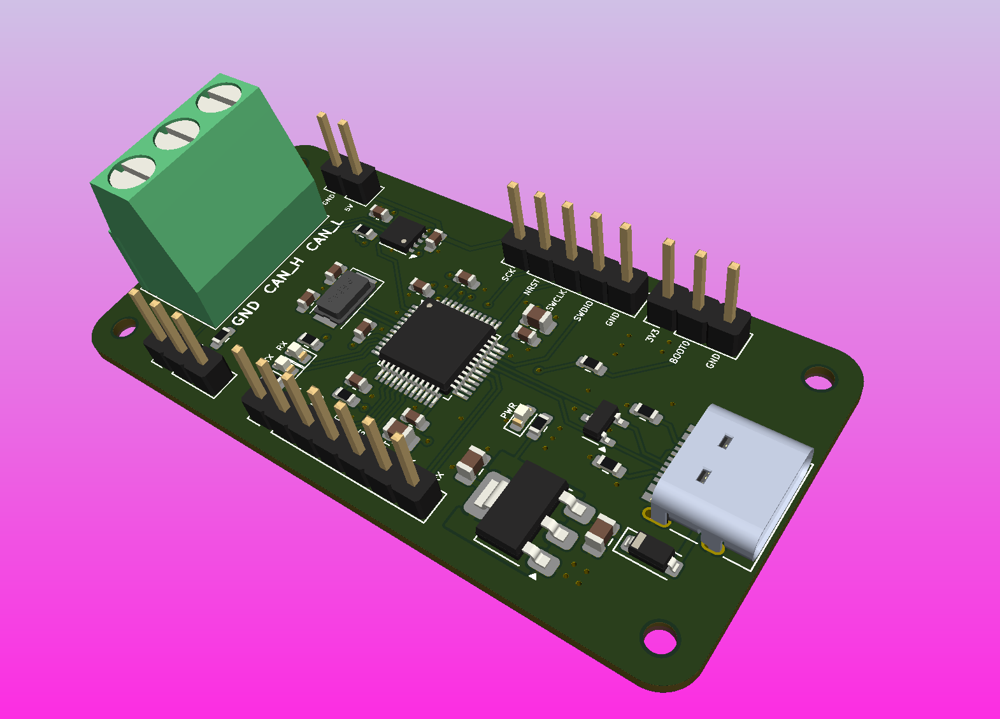
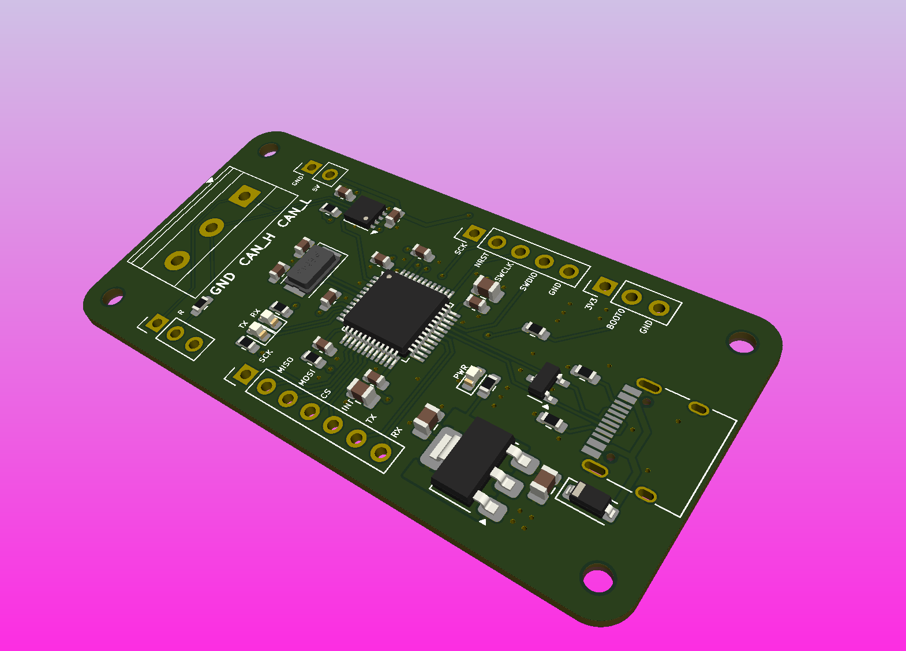
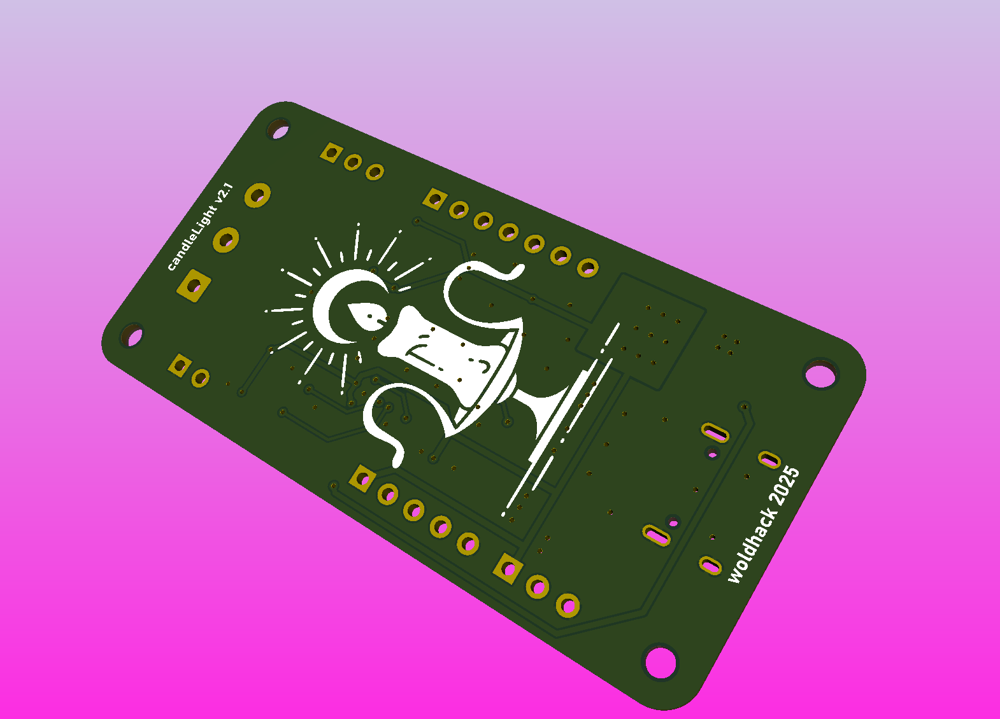
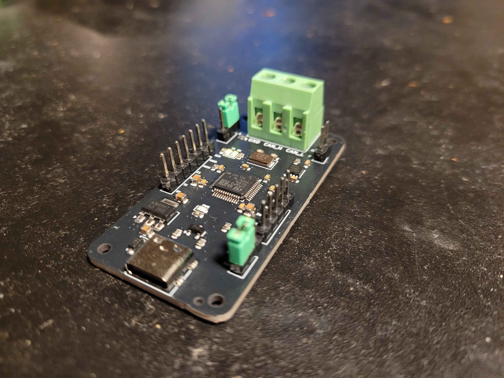
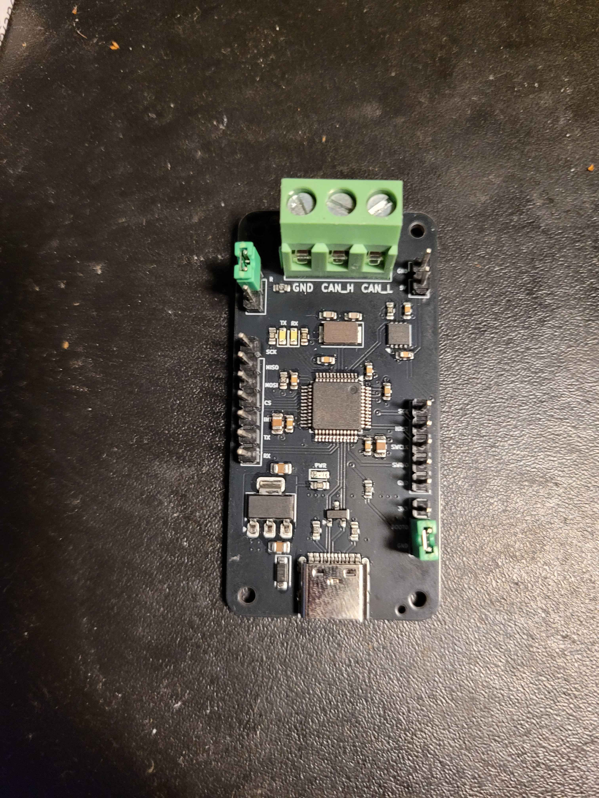
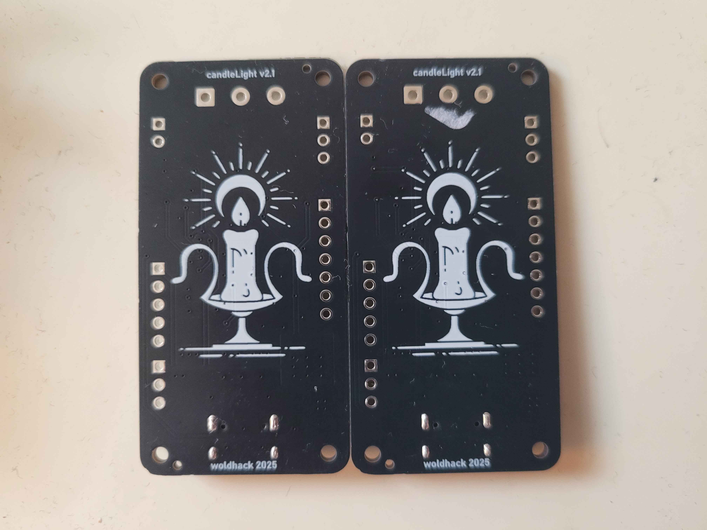
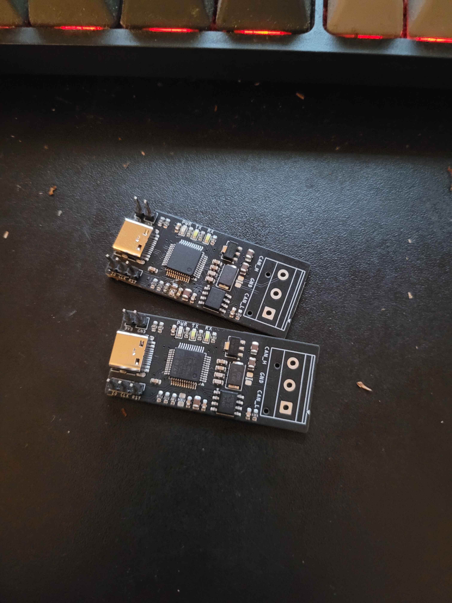
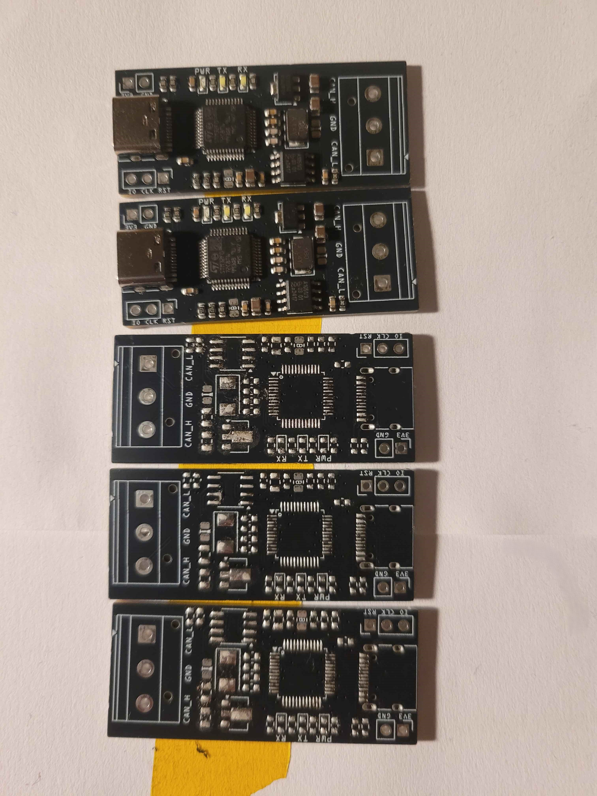
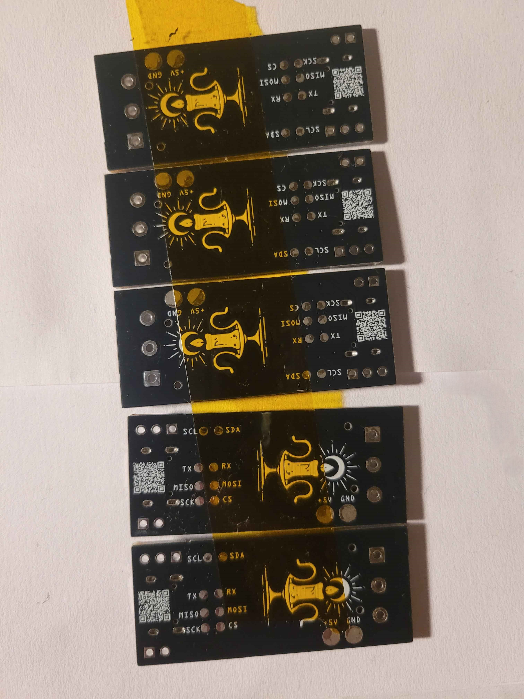

# candleLight

### [v2.1](https://github.com/11philip22/candleLight-v2/tree/v2.1)

    
    
    

    
    
    

### [v2](https://github.com/11philip22/candleLight-v2/tree/v2)

    
    
    

## Changelog
V2.1
- refactored decouplic capacitors
- added switches for nrst and boot0
- pull up resistor on nrst
- more resistance on boot0 resistor
- added switch to toggle can terminator resistor
- change clock to jlc basic part
- added boot0 selection header
- improved SWD header
- upgraded TJA1051-3 to TJA1051TK-3
- added schottky diode in between vbus and V5+
- added ESD protection on usb lines 
- added usart pinheaders
- added spi pinheaders

V2
- change voltage converter
- usb-c
- removed tag-connect connector in favor for regular pin headers
- removed vga CAN connector in favor for a phoenix terminal screw block
- different clock
