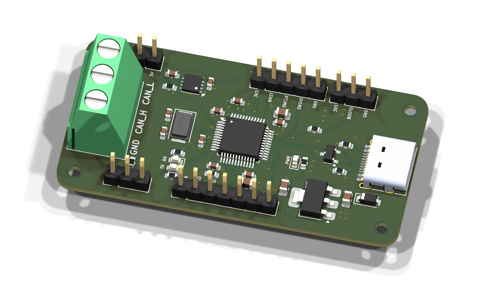
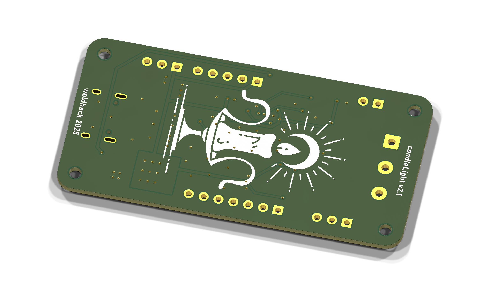
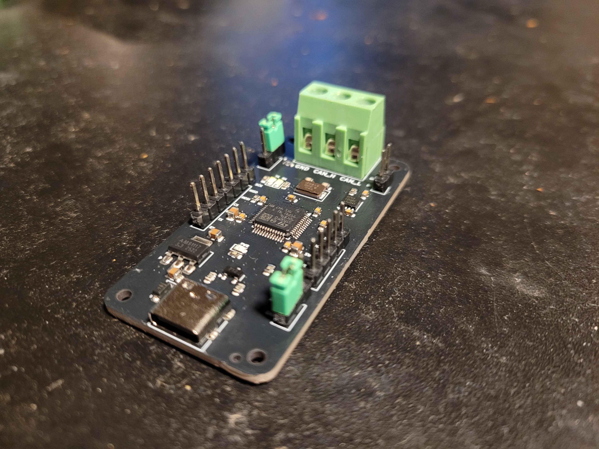
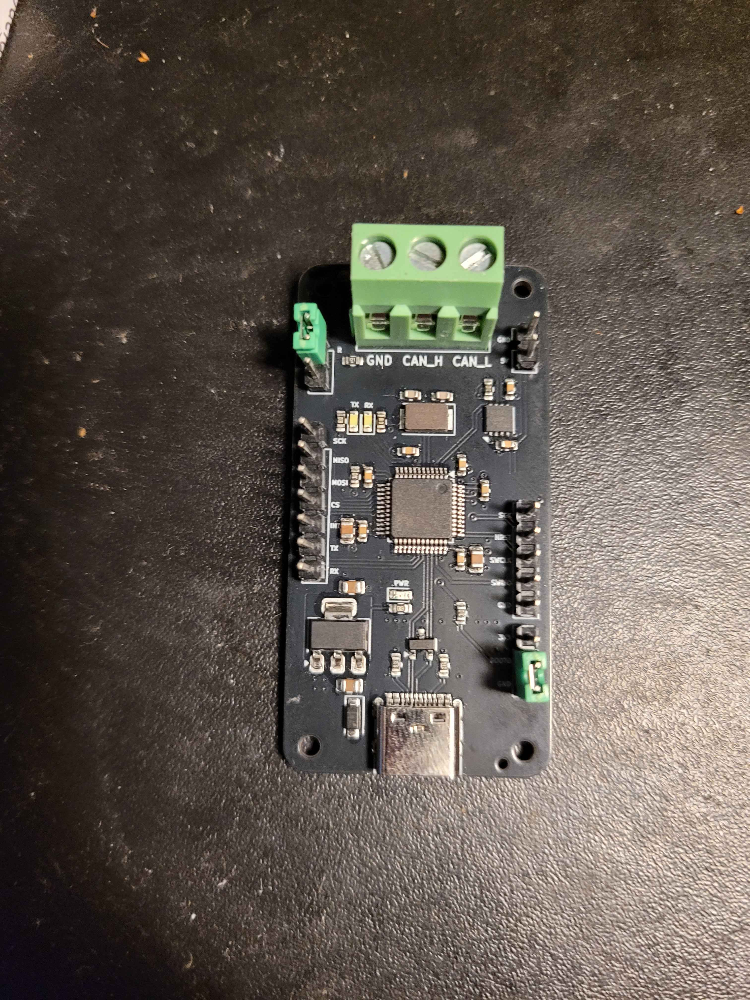
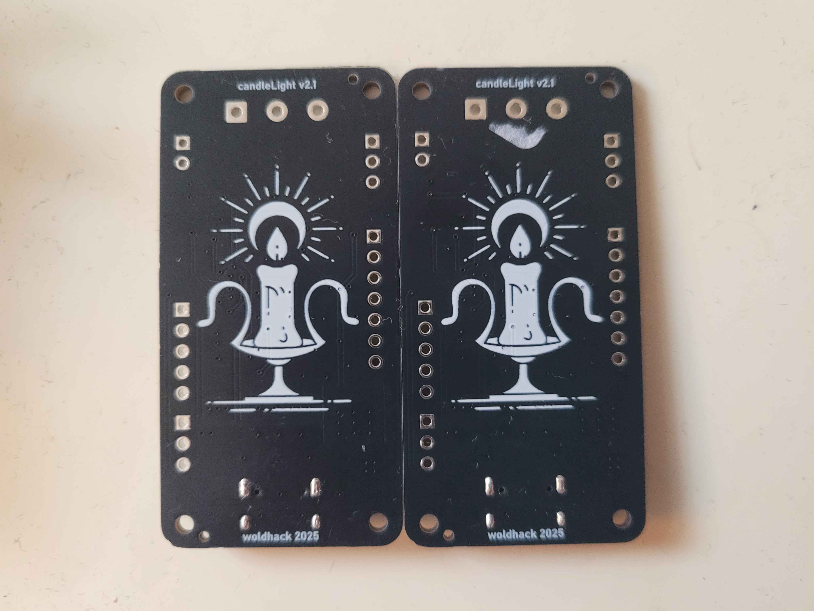
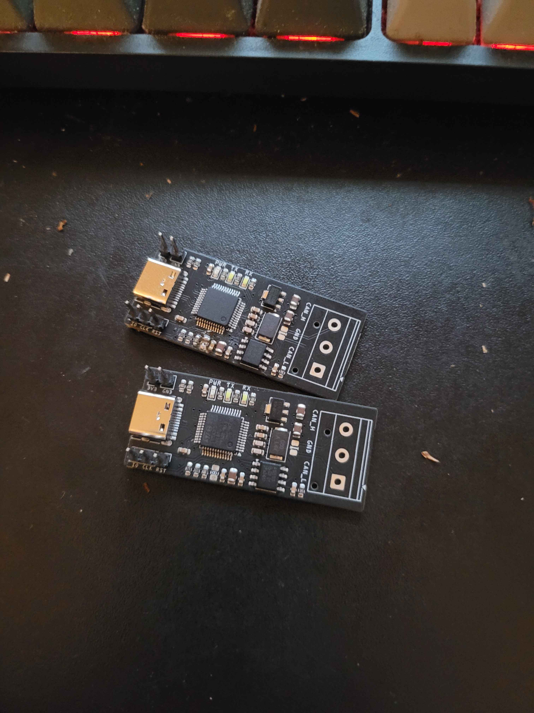
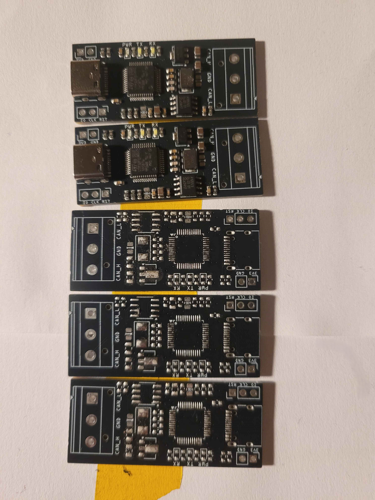
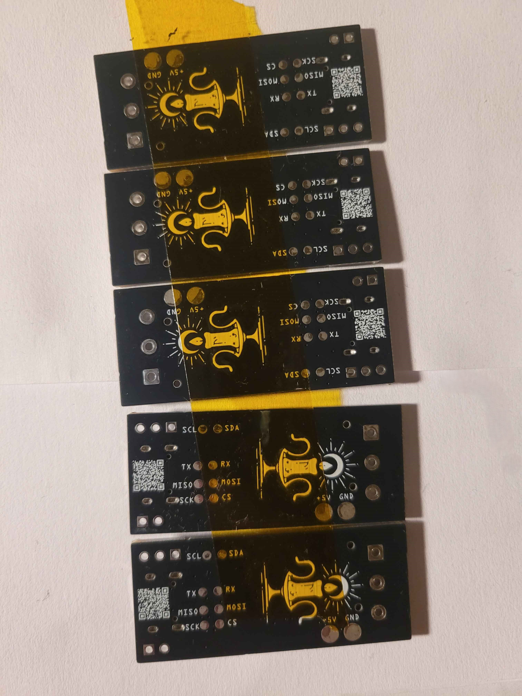

# candleLight USB-to-CAN Adapter

A KiCad **USB-to-CAN adapter** built around the **STM32F072** microcontroller and **TJA1051TK-3** CAN transceiver. USB-C connects to the host, while a screw terminal exposes CAN_H, CAN_L, and GND. The board includes selectable 120 Ω CAN termination and headers for SWD, USART, and SPI.

| Top — USB connector side | Bottom — through-hole models hidden |
| :---: | :---: |
| [](images/candlelight-3d.png) | [](images/candlelight-3d-bottom.png) |

## Project files

| File | Description |
| --- | --- |
| [candleLight.kicad_pro](candleLight.kicad_pro) | KiCad project |
| [candleLight.kicad_sch](candleLight.kicad_sch) | Schematic |
| [candleLight.kicad_pcb](candleLight.kicad_pcb) | Two-layer PCB, revision V2.1, 1.2 mm thick |
| [lib/](lib/) | Custom symbols, footprints, and 3D models (Git submodule) |
| [production/](production/) | Fabrication archive, bill of materials, component positions, and netlist |

## Open in KiCad

Initialize the library submodule before opening the project:

```sh
git submodule update --init --recursive
```

Open `candleLight.kicad_pro` in KiCad 9 or newer, with the standard symbol, footprint, and 3D-model libraries installed. The board references `KICAD9_3DMODEL_DIR`; when using a newer KiCad version, set that path variable to the installed 3D-model library directory if models are missing.

## Board revisions

### [V2.1](https://github.com/11philip22/candleLight-v2/tree/v2.1)

- Reworked decoupling capacitors.
- Added NRST and BOOT0 controls, an NRST pull-up, and a higher-value BOOT0 resistor.
- Added selectable CAN termination and a BOOT0 selection header.
- Changed the crystal to a JLCPCB basic part.
- Improved the SWD header and added USART and SPI headers.
- Upgraded the CAN transceiver from TJA1051-3 to TJA1051TK-3.
- Added a Schottky diode between VBUS and V5+ and ESD protection on the USB lines.

### [V2](https://github.com/11philip22/candleLight-v2/tree/v2)

- Changed the voltage regulator and crystal.
- Switched to USB-C.
- Replaced the Tag-Connect connector with standard pin headers.
- Replaced the VGA-style CAN connector with a Phoenix screw terminal.

## Board photos

### [V2.1](https://github.com/11philip22/candleLight-v2/tree/v2.1)

| Assembly photo 1 | Assembly photo 2 | Assembly photo 3 |
| :---: | :---: | :---: |
| [](images/v2.1_4.jpg) | [](images/v2.1_5.jpg) | [](images/v2.1_6.jpg) |

### [V2](https://github.com/11philip22/candleLight-v2/tree/v2)

| Assembly photo 1 | Assembly photo 2 | Assembly photo 3 |
| :---: | :---: | :---: |
| [](images/v2_1.jpg) | [](images/v2_5.jpg) | [](images/v2_4.jpg) |
